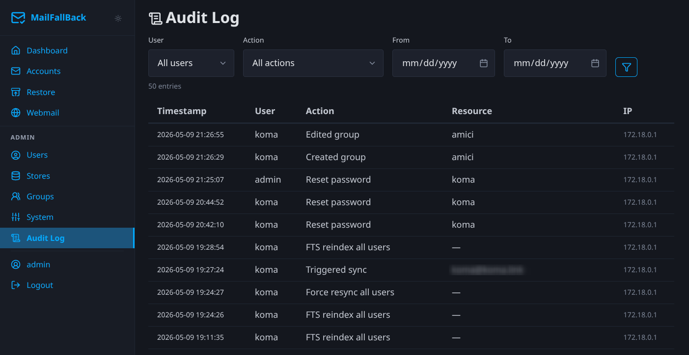

# Audit Log

Every administrative action in MFB is recorded in the audit log. This provides a tamper-evident record of who did what, when, and from where.

## What Gets Logged

The audit log captures actions across all resource types:

| Resource Type | Actions |
|--------------|---------|
| **User** | create, update, delete, enable, disable, password_reset, login, login_sso |
| **Account** | create, update, delete, enable, disable, suspend, unsuspend, sync, ownership_change |
| **Store** | create, update, delete, set_default |
| **Group** | create, update, delete, add_member, remove_member, add_account, remove_account |
| **Restore** | create, cancel, complete, fail |
| **System** | config_export, config_import, fts_reindex, force_resync |

## Log Entry Fields

Each audit log entry contains:

| Field | Description |
|-------|-------------|
| **Timestamp** | When the action occurred (UTC) |
| **Username** | Who performed the action |
| **Action** | What action was taken |
| **Resource Type** | Category of the affected resource |
| **Resource ID** | UUID of the affected resource |
| **Resource Name** | Human-readable name (e.g. email address, username) |
| **IP Address** | Client IP address of the request |
| **Details** | JSON object with additional context (e.g. changed fields, old/new values) |

## Filtering

Use the filter controls at the top of the audit log page to narrow results:

- **User** - filter by the user who performed the action
- **Action** - filter by action type
- **Resource Type** - filter by resource category
- **Date Range** - filter by time period

Filters can be combined. The log is sorted newest-first by default.

## Retention

Audit logs are stored in the PostgreSQL database in the `audit_logs` table. There is no automatic retention policy - logs are kept indefinitely. For large installations, consider setting up a periodic cleanup job or archiving old entries.

## API Access

Audit logs are accessible through the internal API for integration with external SIEM or log aggregation systems. The logs can also be exported as part of the config export feature.
