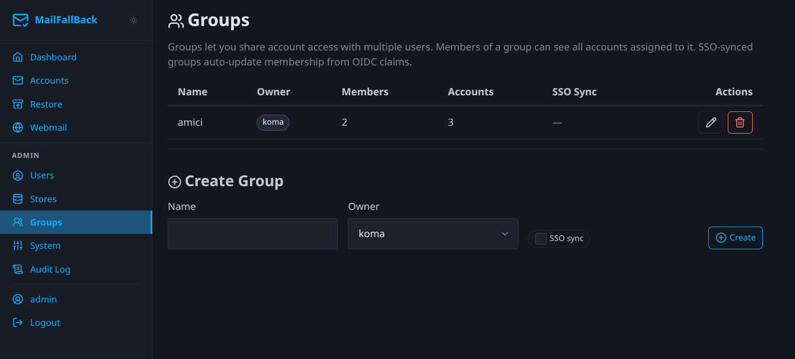

# Groups

Groups provide shared access to email accounts across multiple users. When a user is a member of a group, they can see all accounts assigned to that group in Dovecot (IMAP and webmail).



## How Groups Work

1. An admin creates a group and assigns it an owner
2. Members are added to the group (manually or via SSO sync)
3. Email accounts are assigned to the group
4. All group members can see those accounts in Dovecot as additional namespaces

Group-shared accounts appear in IMAP clients and Roundcube with a prefix showing the account name and email, keeping them visually separate from directly owned accounts.

## Creating a Group

Use the inline "Create Group" form:

1. Enter a **name** (e.g. "Engineering Team", "Shared Inboxes")
2. Select the **owner** (the admin user who manages the group)
3. Toggle **SSO Sync** if you want membership managed automatically from OIDC claims
4. Click **Create**

## Managing Members

After creating a group, click on it to manage membership:

- **Add members** - select users to add to the group
- **Remove members** - click the remove button next to a member

## Assigning Accounts

Assign email accounts to a group from the account detail page:

1. Go to the account detail
2. Open the "Ownership and Visibility" section
3. Select groups to make the account visible to
4. Save

Accounts can be assigned to multiple groups simultaneously.

## SSO Group Sync

When `sso_sync` is enabled on a group, MFB automatically updates the group's membership from OIDC group claims on each SSO login:

1. User logs in via OIDC
2. The OIDC `groups` claim is inspected
3. If the claim contains the group name, the user is added to the group
4. If the claim no longer contains the group name, the user is removed

!!! note "Claim format"
    The OIDC `groups` claim must be a list of group names. The group name in MFB must match the claim value exactly (case-sensitive).

This means you can manage MFB group membership entirely from your identity provider (e.g. Authentik, Keycloak). No manual member management needed.

## Account Visibility Flow

Account visibility in Dovecot is determined by two paths:

```
Account visible to user if:
  1. User is a direct owner (via account_owners table)
  OR
  2. User is a member of a group that has the account assigned
     (via group_members + account_groups tables)
```

The Lua userdb endpoint computes the combined account list at login time and returns dynamic Dovecot namespace configuration.

## Use Cases

- **Team shared mailboxes** - give a support team access to the `support@company.com` backup
- **Department archives** - let the legal department browse archived accounts from departed employees
- **SSO-driven access** - automatically grant access based on Active Directory/LDAP group membership through your identity provider
- **Audit access** - create a group for compliance officers to read specific mailboxes
