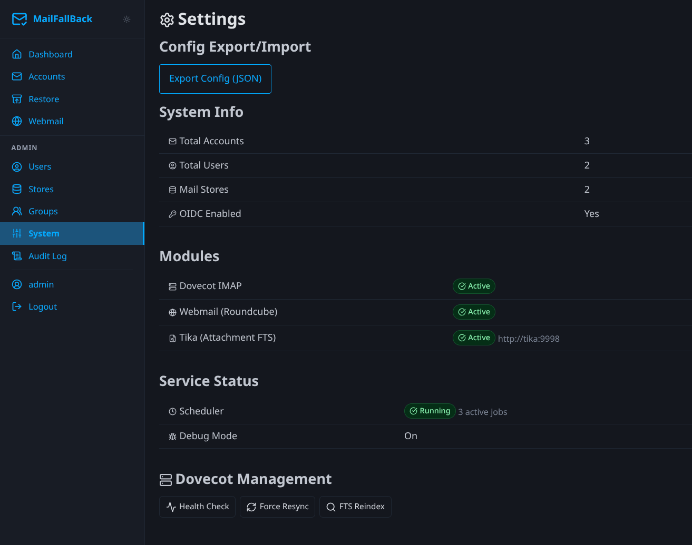

# System Settings

The System page provides system-wide configuration and operational controls.



## Modules

The modules section shows which optional components are active:

| Module | Status | Description |
|--------|--------|-------------|
| **Webmail** | Enabled/Disabled | Roundcube integration |
| **FTS** | Enabled/Disabled | Full-text search (always on when Dovecot is available) |
| **Tika** | Enabled/Disabled | Attachment content indexing |

Module status is determined by environment variables and service availability.

## Service Status

Real-time health check of connected services:

- **Dovecot** - checks the doveadm HTTP API endpoint
- **Tika** - checks the Tika REST API endpoint
- **Database** - PostgreSQL connection status
- **Scheduler** - whether APScheduler is running and processing cron jobs

## FTS Reindex

Trigger a full-text search reindex across all accounts. This is useful after:

- Enabling or disabling Tika
- Recovering from corrupted FTS indexes
- Upgrading Dovecot

The reindex runs as a background task. Progress is shown on the System page.

!!! note "Automatic reindex"
    MFB automatically triggers a reindex when it detects that the FTS configuration has changed (e.g. Tika was toggled). You normally do not need to trigger this manually.

## Force Resync

Force an immediate sync of all accounts, ignoring schedules. This queues a sync job for every enabled account. Useful after a bulk import or when you want to ensure all accounts are up to date.

## Health Check

The System page shows the results of the application health check endpoints:

- `/healthz` - basic liveness check
- `/readyz` - readiness check including database connectivity

These are the same endpoints used by Docker health checks and Kubernetes probes.

## Background Tasks

Active background tasks are displayed with progress:

- **FTS Reindex** - progress bar showing accounts processed
- **Store Migration** - per-account progress with file counts

Tasks can be monitored but not cancelled from this page (migrations can be cancelled from the account detail page).

## Config Export / Import

Export the current MFB configuration (accounts, users, groups, stores) as a JSON file, or import from a previously exported file. This is useful for:

- Backing up MFB's own configuration
- Migrating between MFB instances
- Disaster recovery

!!! warning "Credentials"
    Exported configs include encrypted credentials. They can only be imported into an instance with the same `MAILFALLBACK_SECRET_KEY`. If the secret key differs, imported accounts will need their credentials re-entered.

## Prometheus Metrics

MFB exposes metrics at `/metrics` for Prometheus scraping:

- `mailfallback_accounts_total` - total account count
- `mailfallback_accounts_error` - accounts in error state
- `mailfallback_sync_jobs_total` - sync job counts by status
- `mailfallback_messages_total` - total backed-up messages
- `mailfallback_storage_bytes` - total maildir storage used

Protect the endpoint with `MAILFALLBACK_METRICS_API_KEY`. Prometheus sends the key as a Bearer token in the Authorization header:

```yaml
# prometheus.yml
scrape_configs:
  - job_name: mailfallback
    bearer_token: your-metrics-api-key
    static_configs:
      - targets: ['mailfallback:8000']
```
