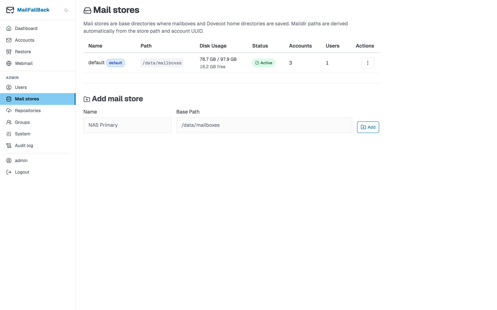

# Mail stores

Mail stores define where email data is physically stored on disk. Each store maps to a filesystem path that holds Maildir directories and Dovecot home directories.



## Store List

The stores table shows:

| Column | Description |
|--------|-------------|
| **Name** | Display name for the store |
| **Path** | Filesystem path (e.g. `/data/mailboxes`) |
| **Default** | Whether this is the default store for new users |
| **Accounts** | Number of email accounts on this store |
| **Users** | Number of users assigned to this store |
| **Enabled** | Whether the store is active |
| **Actions** | Edit, set default, delete |

## Creating a Store

Use the inline "Add Store" form:

1. Enter a **name** (e.g. "Primary Storage", "NFS Archive")
2. Enter the **path** (must be a directory accessible by the MFB and Dovecot containers)
3. Click **Create**

The path must be unique across all stores.

!!! warning "Volume mounts required"
    The store path must be mounted as a Docker volume in both the `mailfallback` and `dovecot` containers. Add the volume to `docker-compose.yml` and restart before creating the store.

## Default Store

One store is marked as the default. New users are automatically assigned to the default store. To change the default:

1. Click the "Set Default" button on the desired store
2. The previous default is unmarked

## Store Layout

Each store path contains:

```
/data/mailboxes/
  {account-uuid}/           # One directory per account
    INBOX/
      cur/
      new/
      tmp/
    Sent/
      cur/
      new/
      tmp/
    Drafts/
    [Gmail]/
      All Mail/
  .dovecot-home/            # Dovecot user home directories
    {username}/
      .flatcurve/           # FTS index data
```

- Account directories are named by UUID, assigned at account creation
- The Dovecot home directory holds per-user data like FTS indexes
- `LAYOUT=fs` is used, meaning folders map directly to filesystem directories (not the Maildir++ dot-prefix convention)

## Migrating Between Stores

To move accounts from one store to another:

1. Go to the account detail page
2. Open the "Migrate Store" section
3. Select the target store
4. Click **Migrate**

During migration:

- The user's `migrating` flag is set to `true`
- Sync jobs are blocked for the affected accounts
- Dovecot login is blocked (SQL auth checks `migrating = false`)
- Files are copied with skip-existing semantics
- File counts are verified between source and destination
- On completion, the database is updated and old files are removed

!!! tip "Crash recovery"
    If MFB restarts during a migration, incomplete migrations are automatically resumed on startup. No manual intervention is needed.

## Orphan Detection

MFB can detect orphaned directories on a store - UUID directories that do not match any account in the database. This can happen if an account was deleted but its maildir was not cleaned up.

Orphan detection is available from the System Settings page under the store management section. It scans each store's filesystem and reports directories that have no corresponding account record.

## Deleting a Store

A store can only be deleted when it has no accounts and no user home directories on it. To drain a store before deletion:

1. Migrate all accounts to another store
2. Reassign all users to a different store
3. Delete the empty store

Attempting to delete a store with active content will show an error with the list of accounts and users still on the store.

## Multiple Stores Use Case

Multiple stores are useful for:

- **Tiered storage** - fast SSD for active accounts, slower HDD/NFS for archives
- **Capacity management** - spread load across volumes
- **Migration** - add a new store, migrate accounts, remove the old one
- **Testing** - try a new storage backend without affecting production data
