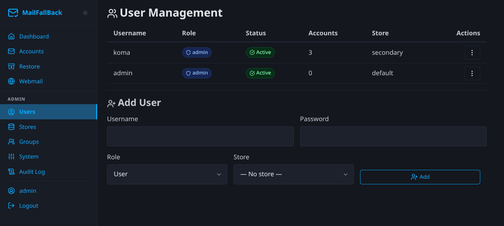

# User Management

Admins can create, edit, and manage users from the **Users** page in the admin section.

## User List

The users table shows:

| Column | Description |
|--------|-------------|
| **Username** | Login name |
| **Role** | `admin` or `user` |
| **Store** | Assigned mail store |
| **Accounts** | Number of owned email accounts |
| **Enabled** | Whether the user can log in |
| **Created** | Account creation date |
| **Actions** | Edit, toggle enabled, reset password, delete |

## Creating a User

Use the inline "Add User" form below the users table:

1. Enter a **username** (must be unique)
2. Enter a **password** (or leave blank for SSO-only users)
3. Select a **role** (admin or user)
4. Select a **mail store** (determines where new accounts are created)
5. Click **Create**

The user is created immediately and can log in right away.

## Editing a User

Click the edit button on a user row to modify:

- **Role** - promote to admin or demote to user
- **Store** - change the user's default mail store
- **Enabled** - toggle login access

!!! warning "Disabling a user"
    Disabling a user prevents login to MFB, Dovecot (IMAP), and Roundcube. Their backed-up mail remains on disk but is inaccessible until the user is re-enabled. Sync jobs for their accounts continue to run.

## Resetting a Password

Click the password reset button to set a new password for a user. This is useful when a user forgets their password and SSO is not configured.

SSO users authenticate through the identity provider and may not have an MFB password at all.

## Deleting a User

Click the delete button to remove a user. This requires confirmation.

!!! warning "Account ownership"
    Deleting a user does not delete their email accounts or backed-up mail. Accounts with no remaining owners become orphaned and visible only to admins. Consider reassigning account ownership before deleting a user.

## Roles

| Role | Capabilities |
|------|-------------|
| **admin** | Full access: manage users, stores, groups, system settings. See all accounts. Configure SSO and OAuth. |
| **user** | Manage own accounts. View own sync history. Access webmail. Change own password and preferences. |

## SSO Users

When OIDC is enabled, users are automatically created on first SSO login. The OIDC group claims determine the role:

- Members of the `oidc_admin_group` get the `admin` role
- Members of the `oidc_user_group` get the `user` role
- Users not in either group are denied access

SSO users can also log in with a local password if one is set.

## Allowed Stores

Admins can restrict which mail stores a user can select for their accounts. By default, a user is allowed only their assigned store. To grant access to additional stores:

1. Edit the user
2. Select the allowed stores
3. Save

This controls the store dropdown when the user creates or edits accounts.
