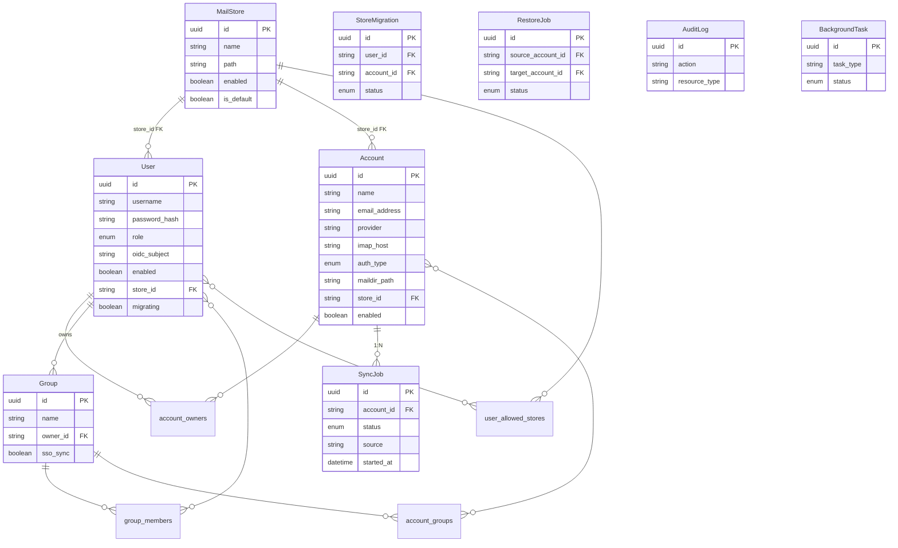

# Data Model

MFB stores all data in PostgreSQL. This page documents the database tables, their columns, and relationships.

## Entity Relationship Diagram

## Tables

### User

Represents a person who can log in to MFB, Dovecot, and Roundcube.

| Column | Type | Description |
|--------|------|-------------|
| `id` | String (UUID) | Primary key |
| `username` | String | Unique login name |
| `password_hash` | String (nullable) | bcrypt hash, null for SSO-only users |
| `role` | Enum | `admin` or `user` |
| `oidc_subject` | String (nullable) | OIDC subject identifier for SSO users |
| `enabled` | Boolean | Whether the user can log in |
| `store_id` | String (FK) | Reference to the user's mail store |
| `migrating` | Boolean | True during store migration (blocks login) |
| `preferences` | JSON | User preferences (e.g. dark mode) |
| `created_at` | DateTime | Creation timestamp |

Relationships:

- `accounts` - many-to-many via `account_owners`
- `store` - many-to-one to `MailStore`
- `allowed_stores` - many-to-many via `user_allowed_stores`
- `groups` - many-to-many via `group_members`

### Account

An email account that MFB backs up via mbsync.

| Column | Type | Description |
|--------|------|-------------|
| `id` | String (UUID) | Primary key |
| `name` | String | Display name |
| `email_address` | String | Email address |
| `provider` | String | Provider identifier (gmail, outlook, other) |
| `imap_host` | String | Upstream IMAP server hostname |
| `imap_port` | Integer | IMAP port (default 993) |
| `auth_type` | Enum | `app_password` or `oauth2` |
| `credentials` | Text (nullable) | Encrypted password or OAuth2 refresh token |
| `imap_user` | String (nullable) | IMAP username override |
| `tls_type` | String | `IMAPS` or `STARTTLS` |
| `maildir_path` | String | Absolute path to the Maildir on disk |
| `sync_schedule` | String (nullable) | Cron expression for automatic sync |
| `extra_config` | Text (nullable) | Additional mbsync config lines |
| `sync_state` | Enum | `idle`, `syncing`, or `error` |
| `last_sync_at` | DateTime (nullable) | Timestamp of last completed sync |
| `last_error` | Text (nullable) | Last sync error message |
| `total_messages` | Integer | Total message count |
| `unread_messages` | Integer | Unread message count |
| `maildir_size_bytes` | Integer | Total storage used |
| `folder_stats` | Text (nullable) | JSON per-folder stats from doveadm |
| `store_id` | String (FK) | Reference to the mail store |
| `enabled` | Boolean | Whether sync is enabled |
| `suspended` | Boolean | Admin suspension (blocks sync + IMAP) |
| `migrating` | Boolean | True during store migration |
| `created_at` | DateTime | Creation timestamp |

Relationships:

- `owners` - many-to-many via `account_owners`
- `sync_jobs` - one-to-many with cascade delete
- `store` - many-to-one to `MailStore`
- `visible_to_groups` - many-to-many via `account_groups`

### MailStore

A named storage location for Maildir data.

| Column | Type | Description |
|--------|------|-------------|
| `id` | String (UUID) | Primary key |
| `name` | String | Display name |
| `path` | String | Unique filesystem path |
| `enabled` | Boolean | Whether the store is active |
| `is_default` | Boolean | Default store for new users |
| `created_at` | DateTime | Creation timestamp |

Relationships:

- `users` - one-to-many (users assigned to this store)
- `accounts` - one-to-many (accounts on this store)

### Group

A named collection of users who share access to email accounts.

| Column | Type | Description |
|--------|------|-------------|
| `id` | String (UUID) | Primary key |
| `name` | String | Unique group name |
| `owner_id` | String (FK) | User who manages the group |
| `sso_sync` | Boolean | Auto-sync membership from OIDC claims |
| `created_at` | DateTime | Creation timestamp |

Relationships:

- `owner` - many-to-one to `User`
- `members` - many-to-many via `group_members`
- `accounts` - many-to-many via `account_groups`

### SyncJob

A record of a sync operation for an account.

| Column | Type | Description |
|--------|------|-------------|
| `id` | String (UUID) | Primary key |
| `account_id` | String (FK) | Account that was synced |
| `status` | Enum | `pending`, `running`, `completed`, `failed`, `cancelled` |
| `source` | String | Who triggered the sync: `api`, `scheduler`, `ui` |
| `requested_at` | DateTime | When the sync was requested |
| `started_at` | DateTime (nullable) | When mbsync started |
| `completed_at` | DateTime (nullable) | When mbsync finished |
| `exit_code` | Integer (nullable) | mbsync process exit code |
| `log` | Text (nullable) | mbsync stdout/stderr output |
| `log_path` | String (nullable) | Path to log file on disk |
| `parsed_summary` | Text (nullable) | Parsed sync summary (new messages, etc.) |
| `mbsync_version` | String (nullable) | mbsync version used |
| `signal` | String (nullable) | Signal if process was killed |

### RestoreJob

A record of a restore operation pushing mail back to an IMAP server.

| Column | Type | Description |
|--------|------|-------------|
| `id` | String (UUID) | Primary key |
| `source_account_id` | String (FK) | Account to restore from (local backup) |
| `target_account_id` | String (FK) | Account to push mail into (remote IMAP) |
| `status` | Enum | `pending`, `running`, `completed`, `failed`, `cancelled` |
| `restore_mode` | Enum | `full`, `folder`, or `selection` |
| `folder_mapping` | String | How folders are mapped (original, flat, prefix) |
| `skip_duplicates` | Boolean | Skip messages with matching Message-ID |
| `selected_folders` | JSON (nullable) | List of folders for folder mode |
| `selected_uids` | JSON (nullable) | Dict of folder-to-UIDs for selection mode |
| `total_messages` | Integer | Total messages to restore |
| `restored_messages` | Integer | Successfully restored count |
| `skipped_messages` | Integer | Skipped (duplicate) count |
| `failed_messages` | Integer | Failed message count |
| `error` | Text (nullable) | Error message if failed |
| `requested_by` | String (FK) | User who started the restore |
| `requested_at` | DateTime | Request timestamp |
| `started_at` | DateTime (nullable) | Start timestamp |
| `completed_at` | DateTime (nullable) | Completion timestamp |

### StoreMigration

Tracks a migration of account data or Dovecot home between mail stores.

| Column | Type | Description |
|--------|------|-------------|
| `id` | String (UUID) | Primary key |
| `user_id` | String (FK, nullable) | User being migrated (for Dovecot home) |
| `account_id` | String (FK, nullable) | Account being migrated (for maildir) |
| `source_store_id` | String (FK) | Source mail store |
| `target_store_id` | String (FK) | Target mail store |
| `status` | Enum | `pending`, `copying`, `verifying`, `cleaning`, `completed`, `failed` |
| `total_files` | Integer | Total files to copy |
| `copied_files` | Integer | Files copied so far |
| `total_bytes` | Integer | Total bytes to copy |
| `copied_bytes` | Integer | Bytes copied so far |
| `error` | Text (nullable) | Error message if failed |
| `started_at` | DateTime (nullable) | Start timestamp |
| `completed_at` | DateTime (nullable) | Completion timestamp |
| `last_resumed_at` | DateTime (nullable) | Last crash-recovery resume |
| `created_at` | DateTime | Creation timestamp |

Either `user_id` or `account_id` is set, never both:

- `account_id` set = maildir migration
- `user_id` set = Dovecot home directory migration

### AuditLog

Immutable record of administrative actions.

| Column | Type | Description |
|--------|------|-------------|
| `id` | String (UUID) | Primary key |
| `timestamp` | DateTime | When the action occurred |
| `user_id` | String (FK, nullable) | User who performed the action (SET NULL on user delete) |
| `username` | String | Username at time of action (preserved after user delete) |
| `action` | String | Action type (e.g. `create`, `update`, `delete`) |
| `resource_type` | String | Resource category (e.g. `user`, `account`, `store`) |
| `resource_id` | String (nullable) | UUID of affected resource |
| `resource_name` | String (nullable) | Human-readable name |
| `ip_address` | String (nullable) | Client IP address |
| `details` | JSON (nullable) | Additional context (changed fields, etc.) |

### BackgroundTask

Tracks long-running background operations.

| Column | Type | Description |
|--------|------|-------------|
| `id` | String (UUID) | Primary key |
| `task_type` | String | Task type (e.g. `fts_reindex`, `force_resync`) |
| `status` | Enum | `pending`, `running`, `completed`, `failed` |
| `progress_current` | Integer | Current progress count |
| `progress_total` | Integer | Total items to process |
| `details` | JSON (nullable) | Task-specific data |
| `started_at` | DateTime (nullable) | Start timestamp |
| `completed_at` | DateTime (nullable) | Completion timestamp |
| `requested_by` | String (FK, nullable) | User who started the task |
| `created_at` | DateTime | Creation timestamp |

## Join Tables

### account_owners

Many-to-many between User and Account.

| Column | Type |
|--------|------|
| `account_id` | String (FK to accounts.id) |
| `user_id` | String (FK to users.id) |

### user_allowed_stores

Many-to-many between User and MailStore. Controls which stores a user can select.

| Column | Type |
|--------|------|
| `user_id` | String (FK to users.id) |
| `store_id` | String (FK to mail_stores.id) |

### group_members

Many-to-many between Group and User.

| Column | Type |
|--------|------|
| `group_id` | String (FK to groups.id) |
| `user_id` | String (FK to users.id) |

### account_groups

Many-to-many between Account and Group.

| Column | Type |
|--------|------|
| `account_id` | String (FK to accounts.id) |
| `group_id` | String (FK to groups.id) |
