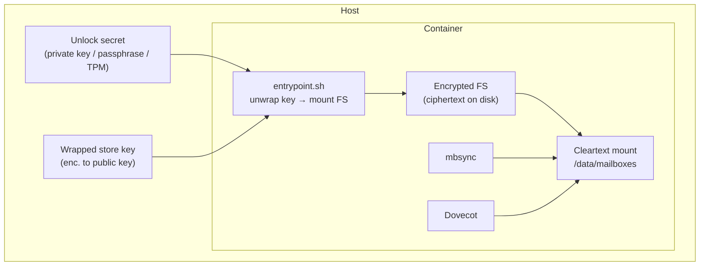

# Encryption at Rest (Design)

!!! warning "Status: Proposed — not yet implemented"
    This is a design document / decision record. It captures the threat model,
    the rejected alternatives, and the chosen architecture for encrypting the
    mail store at rest. No code in this repository implements it yet. It lives
    on the `claude/mbsync-asymmetric-encryption-lghdl3` branch as the agreed
    starting point.

## Goal

Encrypt the backed-up mail **at rest** so that the data is protected with an
**asymmetric** key custody model, **without losing any existing feature** and
**keeping Dovecot as the core read path**.

Three hard constraints, stated up front, drove every decision below:

1. **Asymmetric** — the secret needed to read the data should be separable from
   the running service (held offline / on a token / entered at unlock), so a
   passive copy of the data does not contain its own key.
2. **Dovecot is core** — read-only IMAP fallback via Dovecot must keep working
   exactly as today.
3. **No feature regression** — mbsync incremental sync, FTS, doveadm stats, the
   sync byte sampler/budget, store migration, restore, multi-owner accounts and
   groups must all keep working.

## Threat model

The design target is **theft of data at rest**: a stolen disk, a detached
volume, a filesystem/LVM/ZFS snapshot, a PostgreSQL dump, or an off-site restic
repository falling into the wrong hands. In all of these the attacker obtains a
**passive copy** of bytes and must not be able to read mail.

**Explicitly out of scope:** a live root compromise of the running host. While
the service runs, the store is mounted in clear and the key material is resident
in kernel/process memory; an attacker with root on the live box can read mail.
No at-rest encryption scheme covers this — it is an intrusion-detection /
host-hardening problem, not a data-at-rest problem.

### Why not "the operator cannot read it"

An earlier exploration aimed for *zero-knowledge toward the service operator*
(a multi-tenant SaaS where the host cannot read tenants' mail). That goal is
**structurally unachievable** for a server-side sync service and was dropped
once the product direction was fixed to **self-host first**:

- The server is the **fetcher**: to sync unattended it must store reusable
  upstream credentials (IMAP password / OAuth refresh token). Whoever holds
  those can re-download the mail from the source at any time.
- During ingest the server necessarily handles plaintext (it is downloading it).

In the **self-host** model this is moot: **operator == user**. There is no third
party to hide from. The only meaningful adversary is whoever steals the data at
rest — which the chosen design fully addresses.

!!! note "If a hosted multi-tenant offering is ever built"
    Per-tenant zero-knowledge would require a different design: Dovecot
    `mail-crypt` with a per-user/per-account key hierarchy (user key wraps a
    per-account key shared with each authorised owner/group member), an
    encryption passphrase **separate from SSO login** (SSO authenticates, it
    does not provide a secret the server lacks), ingest re-routed through
    Dovecot's save path, and an honest "operator is not cryptographically
    blind" disclosure. This is recorded here only as the road not taken; it is
    out of scope for self-host first.

## Decision

**Transparent storage-layer encryption of the mail store, with the storage key
held in an asymmetric envelope.**

- The mail store volume (e.g. `/data/mailboxes`) is an **encrypted filesystem**
  (`gocryptfs` or `fscrypt`; `dm-crypt/LUKS` for whole-volume deployments),
  mounted by the container entrypoint **before** Dovecot or mbsync start.
- The filesystem's symmetric master key is never stored in clear next to the
  data. It is **wrapped with a public key** (`age` / OpenPGP recipient, or
  sealed to a TPM). Unlock requires the corresponding **private key /
  passphrase**, supplied at startup and otherwise keepable offline.
- Everything above the mount — mbsync, Dovecot, FTS, doveadm, the sampler,
  migration, restore — sees a **cleartext filesystem** and is **unchanged**.

This satisfies all three constraints: the asymmetry lives in key custody (the
private half can stay off the machine), Dovecot is untouched (it is the
strongest argument *for* this approach — app-level encryption would modify
Dovecot's storage layer), and no feature regresses.



### Why not Dovecot `mail-crypt` (app-level asymmetric)

`mail-crypt` is genuine public-key encryption per message, but for the
self-host / stolen-disk threat model it buys almost nothing over transparent FS
encryption while costing a great deal:

- mbsync writes the Maildir **directly**, bypassing Dovecot's save path, so
  `mail-crypt` would require **re-routing ingest through Dovecot** (IMAP→IMAP or
  `doveadm import`), perturbing the carefully built sampler / budget /
  initial-sync priority pass in `sync_worker.py`.
- FTS indexing, doveadm content stats, restore previews need plaintext and would
  **degrade to "session-unlocked only"**.
- It modifies Dovecot's storage — directly against "Dovecot is core, keep it
  intact".

Transparent FS encryption avoids all of this and meets the actual threat.

### Why not plain symmetric FS encryption (no envelope)

A bare passphrase-only LUKS/gocryptfs is symmetric and fine for stolen-disk, but
the **asymmetric envelope** adds: the private half can live off the host (token,
TPM, ops vault), key rotation without re-encrypting data (rewrap the master key
to a new recipient), and a clean multi-recipient story (wrap to several public
keys for break-glass recovery). The data-path crypto stays symmetric (fast); the
*custody* is asymmetric.

## Key management lifecycle

| Phase | Behaviour |
|---|---|
| **Provision** | Generate the FS master key; wrap it to the configured public recipient(s). Store only the wrapped blob. |
| **Unlock (boot)** | Entrypoint obtains the private key / passphrase (env, mounted secret, prompt, or TPM), unwraps the master key, mounts the FS, then releases the services. Services must not start until the mount is ready (startup gate). |
| **Rotation** | Re-wrap the master key to a new recipient; no data re-encryption. Optionally rotate the FS key itself (gocryptfs supports this) as a heavier operation. |
| **Recovery** | Because this is a **backup** with the source of truth upstream, a lost unlock secret is **not catastrophic**: re-provision the store and re-sync from upstream. Optional break-glass: wrap the master key to a second offline recipient at provision time. |

!!! tip "Lost-passphrase recovery is a selling point"
    "Forgot your passphrase? Re-provision and we re-sync from your provider."
    Few backup products can offer painless recovery, precisely because the
    upstream mailbox remains the source of truth.

## Pluggable key provider

To keep the open core deployable both on a home server and on managed
infrastructure without forking, the unlock secret is obtained through a small
**key-provider interface** rather than hard-coded. The core ships local
providers; managed providers plug in behind the same contract.

```
KeyProvider:
    unwrap_store_key() -> bytes      # return the FS master key at boot
    rewrap(to_recipient) -> None     # rotate custody without re-encrypting data
```

Open-core providers (self-host):

| Provider | Custody |
|---|---|
| `passphrase` | operator-entered passphrase (KDF) |
| `age` / `openpgp` | master key wrapped to a public recipient; private key offline / on a token |
| `tpm` | master key sealed to the host TPM (no secret to type) |

Managed providers (e.g. a hosted/cloud KMS such as Cloud KMS, with HSM-backed
or external keys) implement the **same interface** and are injected at deploy
time. The mapping is natural: our "asymmetric envelope" *is* envelope encryption
— a managed KMS simply holds the wrapping key, with rotation, audit, and
hardware backing handled for you.

!!! note "Deployment topologies are out of scope here"
    How the encrypted store, sync jobs, and the IMAP tier are placed on managed
    infrastructure (and any multi-tenant key hierarchy) is a separate concern
    and is **not** documented in this open-core repository. This page covers
    only the single-instance, self-hostable core.

## Feature impact

| Area | Outcome |
|---|---|
| mbsync incremental sync (`SyncState`) | ✅ unchanged |
| Dovecot read-only IMAP + ACL | ✅ unchanged |
| FTS Flatcurve / doveadm stats / restore | ✅ unchanged (cleartext mount) |
| Sync byte sampler / budget (`sync_worker`) | ✅ unchanged |
| Store migration | ✅ unchanged |
| Multi-owner accounts / groups | ✅ unchanged |
| restic off-site | ✅ still encrypted with its own key (cipher-on-cipher) |
| Live-root-compromise protection | ❌ out of scope (see threat model) |

## Code & ops impact

Deliberately small and confined to the boot/ops layer — **no DB migration, no
changes to `sync_worker.py`, `mbsync_config.py`, or Dovecot config generation**:

- `docker/entrypoint.sh` — unwrap key, mount the encrypted store before services,
  startup gate, clean unmount on shutdown.
- `config.py` + `.env.example` — encryption mode, key provider (passphrase / key
  file / TPM), recipient(s), store mount paths.
- Startup ordering so Dovecot/mbsync never touch an unmounted (ciphertext) path.
- Docs — update `disaster-recovery.md` (the unlock secret joins
  `MAILFALLBACK_SECRET_KEY` and the Postgres dump as a must-back-up item) and
  add a published threat-model page.

## Open questions

1. **FS layer**: `gocryptfs` (FUSE, per-file, simple in-container) vs `fscrypt`
   (native ext4/f2fs, per-directory keys — could key each `{account-uuid}` dir)
   vs `dm-crypt/LUKS` (whole volume, host-level). Leaning `gocryptfs` for a
   turnkey in-container experience; `fscrypt` if per-account key granularity is
   wanted later.
2. **Envelope tooling**: `age` (simple, modern) vs OpenPGP (ubiquitous, hardware
   tokens) vs TPM sealing (no secret to type, bound to the host).
3. **Unlock UX**: unattended (key file / TPM — survives reboot, weaker) vs
   interactive (passphrase at boot — stronger, needs operator presence). Likely
   configurable per deployment.
4. **Granularity**: single store key vs per-account keys (enables not loading a
   suspended account's key; more moving parts).

## Phased plan (once the design is approved)

1. **Spike**: entrypoint mounts a `gocryptfs` store from an `age`-wrapped key;
   verify Dovecot + mbsync run unmodified against the mount.
2. **Config & gate**: wire `config.py`/`.env`, enforce startup ordering, clean
   unmount, health gating.
3. **Key lifecycle**: provision, rotation (rewrap), break-glass recipient.
4. **Docs & threat model page**; update disaster recovery.
5. **Optional**: per-account key granularity; TPM provider.
