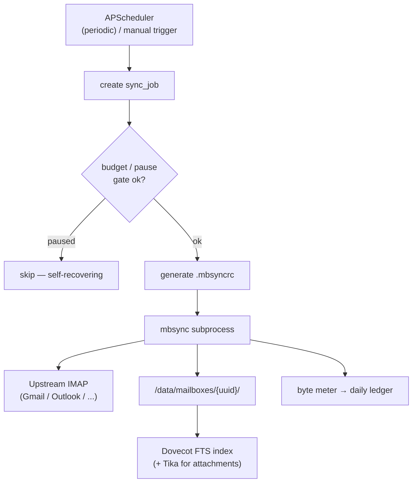
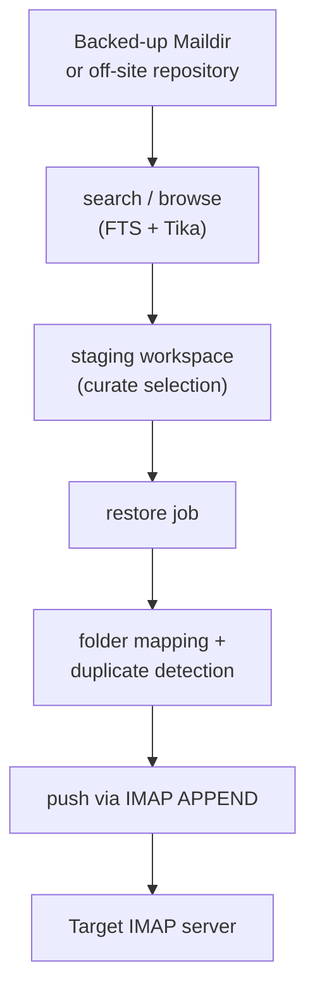
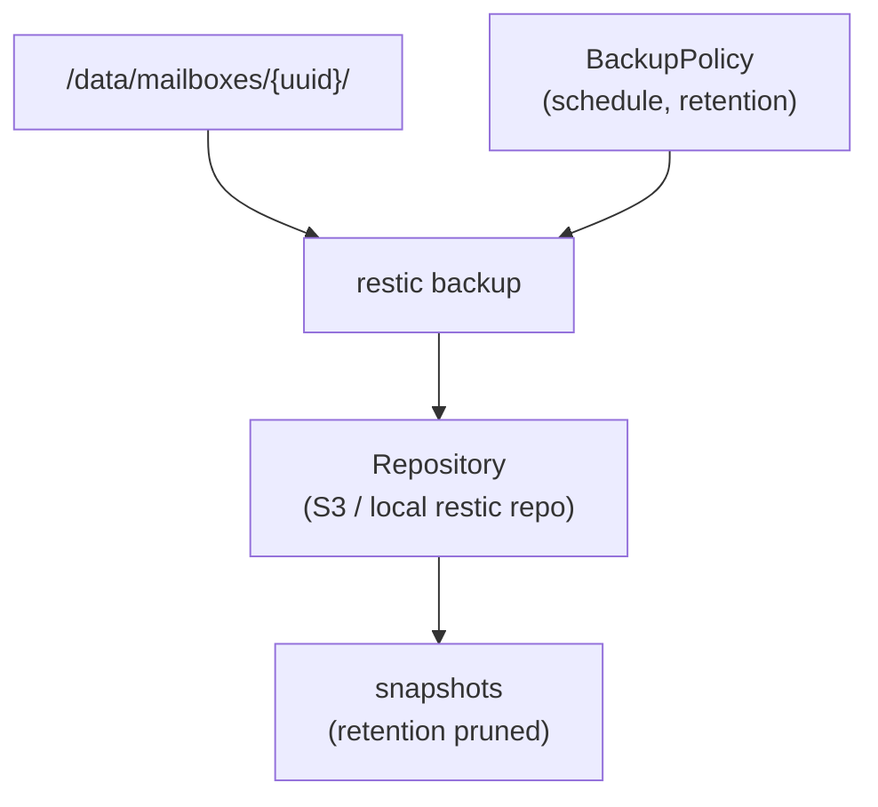
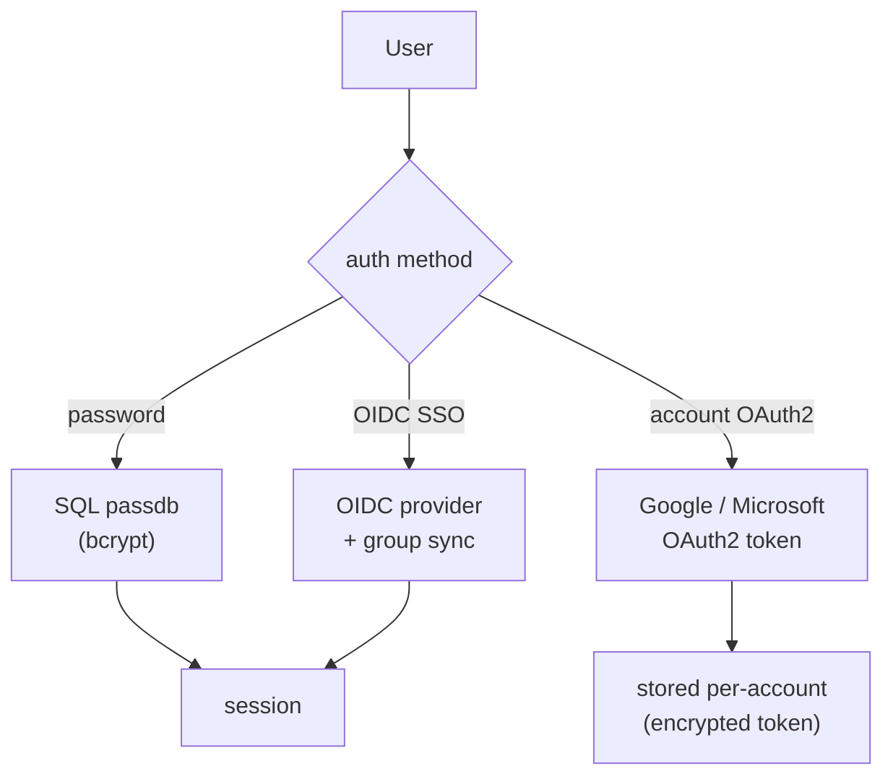

# Runtime Flows

Sequence and flow diagrams for the main runtime paths. For the static
component/dependency view, see [Overview](overview.md).

## Backup sync

How a scheduled or manual sync pulls mail from upstream into local Maildir.

## Restore & staging

How backed-up mail is pushed back to a live server, optionally curated in a
staging workspace first.

## Off-site backup

How local Maildir is copied to an off-site restic repository.

## Authentication

The three ways a user authenticates to MFB.

