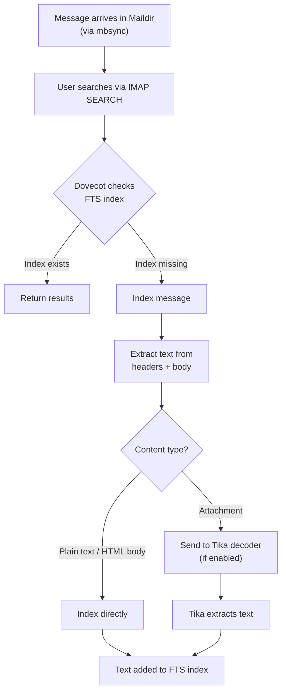

# FTS and Tika

MailFallBack uses Dovecot's FTS (Full-Text Search) Flatcurve engine to index message content for fast searching. Apache Tika can be optionally enabled to extend search to attachment content.

## How FTS Works

### Indexing Pipeline



### Flatcurve Engine

MFB uses [FTS Flatcurve](https://doc.dovecot.org/2.4/settings/plugin/fts-flatcurve-plugin/), a Dovecot-native FTS engine based on Xapian. Key characteristics:

- **No external service required** - indexes are stored as files inside the Dovecot home directory
- **Per-user indexes** - each user has their own FTS index under `.dovecot-home/{username}/.flatcurve/`
- **Automatic indexing** - messages are indexed on first search (`fts_search_add_missing = yes`)
- **Low memory footprint** - suitable for self-hosted deployments

### Configuration

The FTS configuration is generated by MFB:

```conf
mail_plugins {
  fts = yes
  fts_flatcurve = yes
}

fts flatcurve {
  commit_limit = 500
  min_term_size = 2
  substring_search = no
  rotate_count = 5000
  rotate_time = 5000s
  optimize_limit = 10
}

fts_search_add_missing = yes
```

| Setting | Value | Description |
|---------|-------|-------------|
| `commit_limit` | 500 | Flush index to disk after this many messages |
| `min_term_size` | 2 | Minimum word length to index |
| `substring_search` | no | Only match word prefixes, not substrings (faster) |
| `rotate_count` | 5000 | Rotate index segment after this many messages |
| `rotate_time` | 5000s | Rotate index segment after this many seconds |
| `optimize_limit` | 10 | Merge segments when there are this many |
| `fts_search_add_missing` | yes | Index messages on-the-fly when searched |

## Apache Tika

[Apache Tika](https://tika.apache.org/) is a content analysis toolkit that extracts text from binary file formats. When enabled, Dovecot sends attachment content to Tika for text extraction before indexing.

### Supported Formats

Tika can extract searchable text from:

- PDF documents
- Microsoft Office files (Word, Excel, PowerPoint)
- OpenDocument formats (ODF)
- Rich Text Format (RTF)
- Plain text files
- HTML content
- Image files (via OCR, if Tesseract is available in the Tika image)
- Archive contents (ZIP, TAR)
- And hundreds of other formats

### Enabling Tika

1. Start the Tika container:

    ```bash
    docker compose --profile tika up -d
    ```

2. Enable in `.env`:

    ```ini
    MAILFALLBACK_TIKA_ENABLED=true
    ```

3. Restart MFB:

    ```bash
    docker compose restart mailfallback
    ```

MFB regenerates the Dovecot FTS configuration to include the Tika decoder:

```conf
fts_decoder_driver = tika
fts_decoder_tika_url = http://tika:9998/tika/
```

### Automatic Reindex on Config Change

When Tika is toggled (enabled or disabled), MFB:

1. Detects the configuration change at boot via a marker file
2. Purges all existing FTS Flatcurve indexes from every user's Dovecot home
3. Sets a `needs_fts_reindex` flag
4. Submits a background task to reindex all accounts

This ensures that search results are consistent. Without reindexing, messages indexed before Tika was enabled would not have their attachment content searchable.

!!! note "Reindex duration"
    The initial reindex can take significant time depending on the number of messages and attachments. Search works during reindexing - messages are indexed on-the-fly when searched.

### Disabling Tika

If you disable Tika:

1. Remove or comment out `MAILFALLBACK_TIKA_ENABLED=true` from `.env`
2. Restart MFB
3. FTS indexes are automatically purged and rebuilt without attachment content
4. You can stop the Tika container:

    ```bash
    docker compose --profile tika stop
    ```

## Triggering a Manual Reindex

From the **System** page in the admin UI, click the "FTS Reindex" button. This:

1. Creates a background task
2. Purges all FTS indexes
3. Triggers Dovecot to rebuild indexes for all mailboxes
4. Reports progress as accounts are processed

## Index Storage

FTS indexes are stored inside Dovecot home directories:

```
/data/mailboxes/.dovecot-home/{username}/.flatcurve/
```

Index size depends on message volume. As a rough estimate, FTS indexes add approximately 10-20% overhead relative to the maildir size. With Tika enabled, indexes may be slightly larger due to extracted attachment text.

## Search Behavior

### Without Tika

- Message headers (From, To, Subject, etc.) are searchable
- Plain text and HTML message bodies are searchable
- Attachment filenames are searchable
- Attachment content is NOT searchable

### With Tika

- Everything above, plus:
- Full text content of all supported attachment formats
- Extracted metadata from binary files

### From Roundcube

In Roundcube, select "Entire message" as the search scope to search through all indexed content including attachment text. The default "Subject" scope only searches the subject header.

### From IMAP Clients

Any IMAP client that supports the SEARCH command will benefit from FTS indexing. The search is handled server-side by Dovecot, so results are fast regardless of the client.
