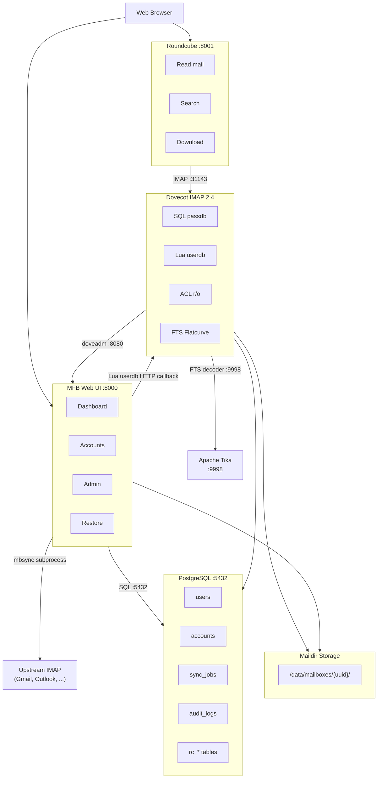
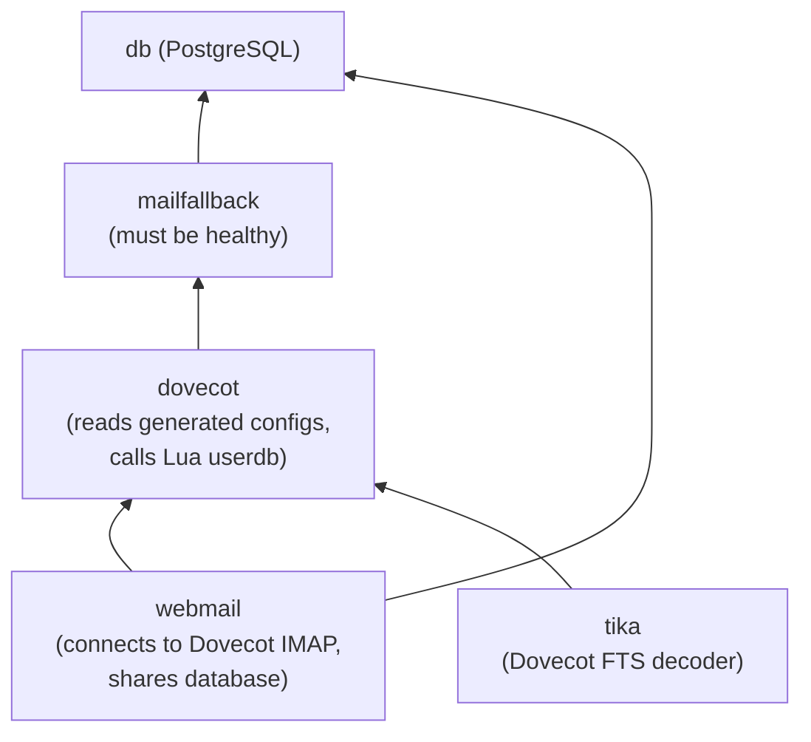

# Architecture Overview

MailFallBack is a multi-container application where the MFB service acts as the control plane, managing configuration and orchestration for all sidecar services.

## Component Diagram

## Data Flow

### Backup Flow (mbsync)

1. The APScheduler fires based on each account's cron schedule
2. MFB generates an mbsync configuration file for the account
3. mbsync runs as a subprocess, connecting to the upstream IMAP server
4. Mail is downloaded to the account's Maildir directory on the store volume
5. The sync job status and stats are recorded in PostgreSQL

### IMAP Access Flow (Dovecot)

1. A user connects to Dovecot via IMAP (directly or through Roundcube)
2. Dovecot authenticates the user via SQL passdb (checks MFB's `users` table)
3. Dovecot calls the Lua userdb, which makes an HTTP request to MFB's internal API
4. MFB returns the list of accounts the user can access (owned + group-shared)
5. Dovecot creates dynamic namespaces for each account
6. The user sees their backed-up mail, read-only via ACLs

### Config Generation Flow

1. MFB starts and calls `generate_all_configs()` during the lifespan event
2. Dovecot config files are written to the shared `dovecot_confd` volume
3. Roundcube config (if webmail enabled) is written to the `webmail_conf` volume
4. Dovecot reads these configs when it starts (it depends on MFB being healthy)
5. Roundcube reads its config from the shared volume

This means no manual editing of Dovecot or Roundcube configuration is needed. MFB is the single source of truth.

## Service Dependencies

MFB must be healthy before Dovecot starts, because Dovecot needs the generated config files. Roundcube must wait for Dovecot. Tika has no dependencies and can start independently.

## Key Design Decisions

### UUID-Based Maildir Paths

Account maildirs use UUID directories (`/data/mailboxes/{uuid}/`) instead of email-based paths. This provides:

- **No conflicts** - multiple accounts with the same email from different providers
- **No special characters** - UUIDs are filesystem-safe
- **Decoupled from identity** - changing ownership is a database-only operation, no file moves

### Centralized Config Generation

Rather than requiring manual configuration of Dovecot and Roundcube, MFB generates all config files at boot from environment variables. This means:

- One place to configure everything (the `.env` file)
- No config drift between services
- Feature flags (Tika, webmail, SSO) automatically propagate to sidecar configs

### Read-Only IMAP via ACLs

Dovecot ACLs enforce read-only access: `* owner lrs` (lookup, read, write-seen). Users can read messages and mark them as read, but cannot delete, move, or modify anything. mbsync writes directly to the filesystem, bypassing Dovecot ACLs entirely, so backups are unaffected.

### Multi-Owner Accounts

The many-to-many relationship between users and accounts (via `account_owners`) means:

- One account can have multiple owners
- Ownership changes are instant (no file operations)
- Group-based access adds another visibility layer without affecting ownership

### Single UID Across Containers

All containers run as UID 1000 (user `vmail`). This ensures consistent file ownership on shared volumes, which is critical for Kubernetes pod-level volume sharing.
