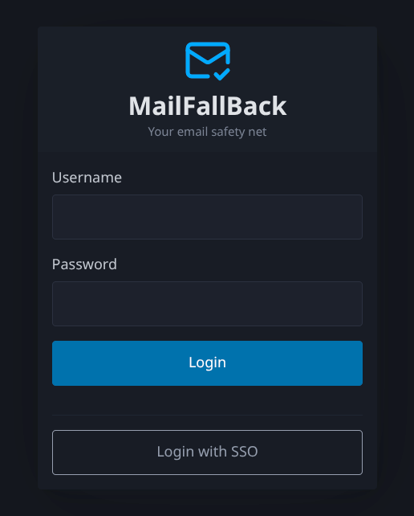

# Installation

MailFallBack runs as a set of Docker containers managed by Docker Compose. This guide covers the standard deployment.

## Prerequisites

- **Docker** 24.0 or later
- **Docker Compose** v2 (included with Docker Desktop, or install the `docker-compose-plugin` package)
- A machine with at least 1 GB of RAM and sufficient disk space for your mail backups

## Clone the Repository

```bash
git clone https://github.com/thekoma/mailfallback.git
cd mailfallback
```

## Configure Environment

Copy the example environment file and edit it:

```bash
cp .env.example .env
```

At minimum, change these values:

```ini
MAILFALLBACK_SECRET_KEY=generate-a-random-string-here
MAILFALLBACK_SESSION_SECRET=generate-another-random-string-here
```

Generate random strings with:

```bash
openssl rand -hex 32
```

See the [Configuration reference](configuration.md) for all available environment variables.

## Start the Services

```bash
docker compose up -d
```

This starts the core services:

| Service        | Port  | Description                    |
|----------------|-------|--------------------------------|
| `mailfallback` | 8000  | Web UI and API                 |
| `db`           | -     | PostgreSQL database            |
| `dovecot`      | 31143 | IMAP access to backed-up mail  |

The database schema is applied automatically on first start.

## First Login

Open `http://localhost:8000` in your browser.



Log in with the default credentials:

- **Username:** `admin`
- **Password:** `changeme1234!`

!!! warning "Change the default password"
    Change the admin password immediately after first login. Go to the **Profile** page and set a new password.

## Optional Services

### Webmail (Roundcube)

To enable the browser-based webmail interface:

```bash
docker compose --profile webmail up -d
```

This starts Roundcube on port `8001`. Set the `MAILFALLBACK_WEBMAIL_URL` variable to show the Webmail link in the MFB navigation bar:

```ini
MAILFALLBACK_WEBMAIL_ENABLED=true
MAILFALLBACK_WEBMAIL_URL=http://localhost:8001
```

### Full-Text Search (Apache Tika)

To enable attachment content indexing (PDF, Word, Excel, etc.):

```bash
docker compose --profile tika up -d
```

Enable Tika in your `.env`:

```ini
MAILFALLBACK_TIKA_ENABLED=true
```

!!! tip "Restart after enabling Tika"
    After changing `MAILFALLBACK_TIKA_ENABLED`, restart the mailfallback service. MFB will regenerate Dovecot configs and trigger a full FTS reindex automatically.

## Verify the Installation

Check that all services are healthy:

```bash
docker compose ps
```

All services should show `healthy` or `running` status.

You can also check the health endpoint:

```bash
curl http://localhost:8000/healthz
# {"status":"ok"}
```

## Updating

To update to the latest version:

```bash
git pull
docker compose up -d --build
```

Database migrations run automatically on startup.

!!! warning "Never use `docker compose down -v`"
    The `-v` flag deletes all Docker volumes, including your mail data and database. Use `docker compose down` (without `-v`) to stop services safely.
