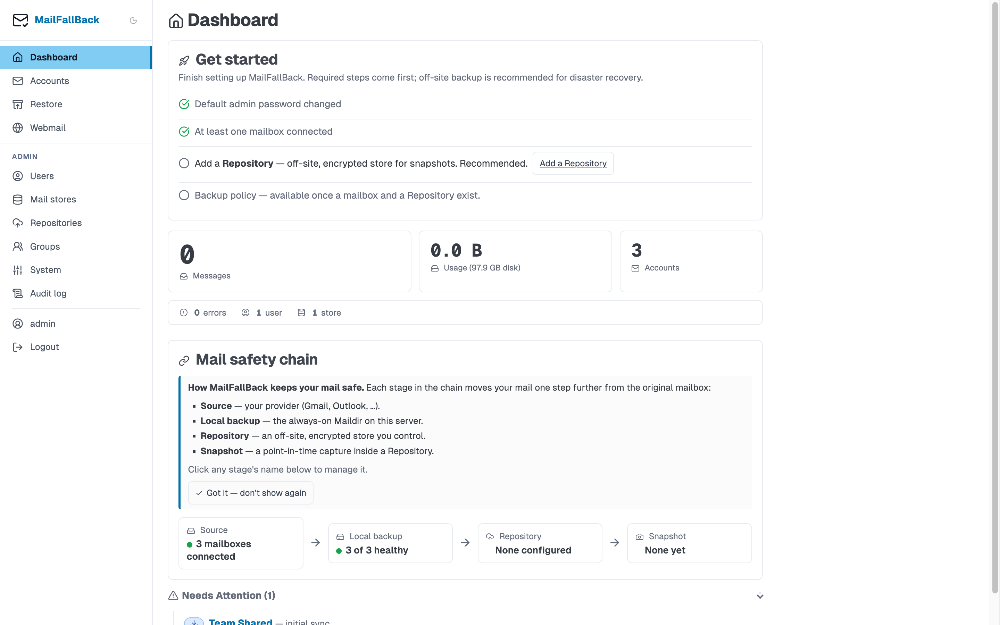
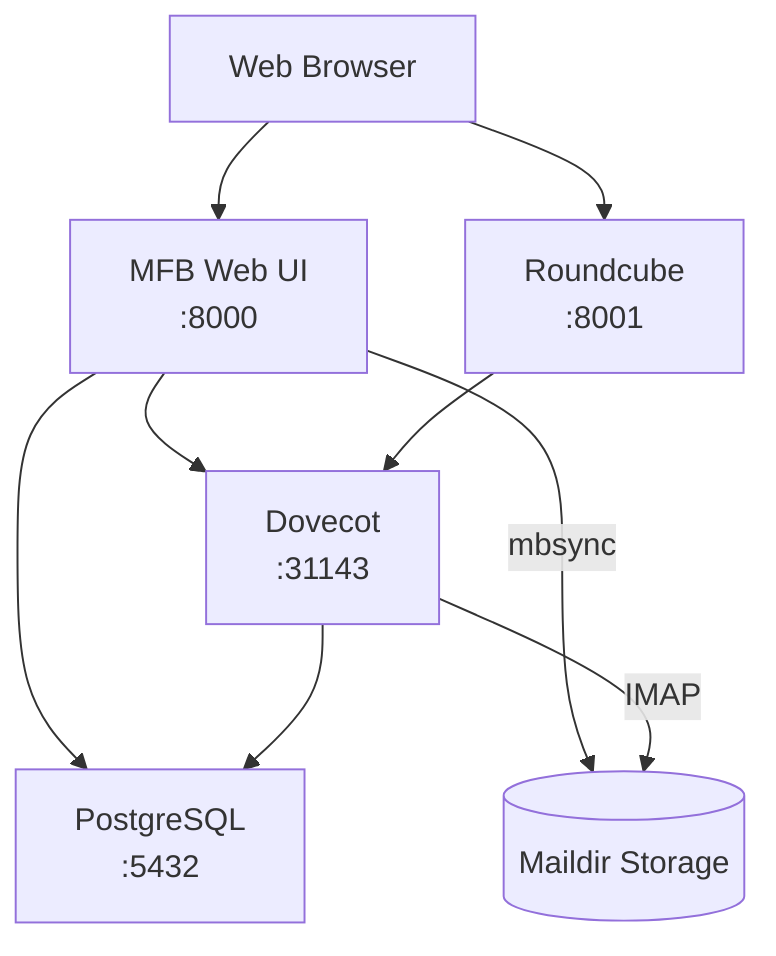

# MailFallBack

**Self-hosted email backup service with web UI, read-only IMAP access, and full-text search.**

MailFallBack (MFB) wraps [mbsync/isync](https://isync.sourceforge.io/) with a modern web interface to back up your IMAP mailboxes to local Maildir storage. When your email provider goes down or you lose access, your mail is still available through Dovecot IMAP and Roundcube webmail - read-only, safe, and searchable.



## Key Features

- **Automated IMAP backup** - Schedule periodic syncs from any IMAP provider using mbsync. Supports Gmail, Outlook, and any standard IMAP server.
- **OAuth2 and app passwords** - Authenticate with Google and Microsoft OAuth2 or use traditional app passwords for other providers.
- **Read-only IMAP access** - Browse your backed-up mail through Dovecot with ACL-enforced read-only access. Your backup stays untouched.
- **Roundcube webmail** - Optional browser-based webmail interface for reading your backed-up messages without a dedicated email client.
- **Full-text search** - Dovecot FTS Flatcurve indexes message bodies. Enable Apache Tika to also search inside PDF, Word, and other attachments.
- **Multi-user with SSO** - Multiple users, role-based access (admin/user), OIDC single sign-on with automatic group synchronization.
- **Groups and shared access** - Share account visibility across users through groups. SSO-synced groups update membership automatically from OIDC claims.
- **Mail store management** - Multiple storage backends with live migration between stores. Orphan detection finds abandoned mailboxes on disk.
- **Restore to IMAP** - Push backed-up messages back to a live IMAP server with folder mapping, duplicate detection, and progress tracking.
- **Audit logging** - Every administrative action is recorded with user, timestamp, IP address, and details.
- **Centralized config generation** - MFB generates all Dovecot and Roundcube configuration at boot. No manual config editing for sidecars.
- **Prometheus metrics** - Export sync stats, account health, and system metrics for monitoring.

## Architecture at a Glance



MFB is the control plane. It generates configuration for Dovecot and Roundcube, manages accounts and users in PostgreSQL, and runs mbsync to pull mail from upstream IMAP servers into Maildir storage. Dovecot serves that storage as read-only IMAP. Roundcube provides browser-based access to Dovecot.

## Quick Start

```bash
git clone https://github.com/thekoma/mailfallback.git
cd mailfallback
cp .env.example .env
# Edit .env with your secrets
docker compose up -d
```

Open `http://localhost:8000` and log in with `admin` / `changeme1234!`.

See the [Installation guide](getting-started/installation.md) for full setup instructions.

## License

MailFallBack is open source software.
