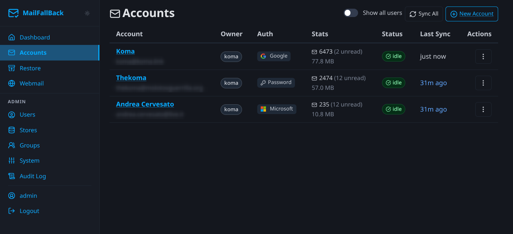
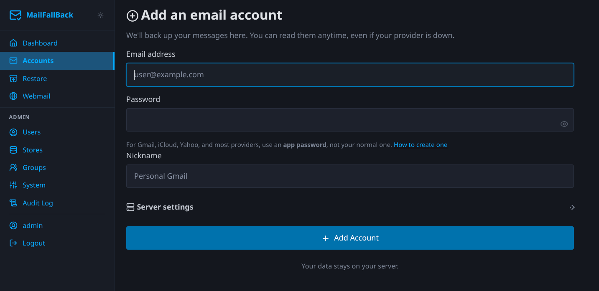
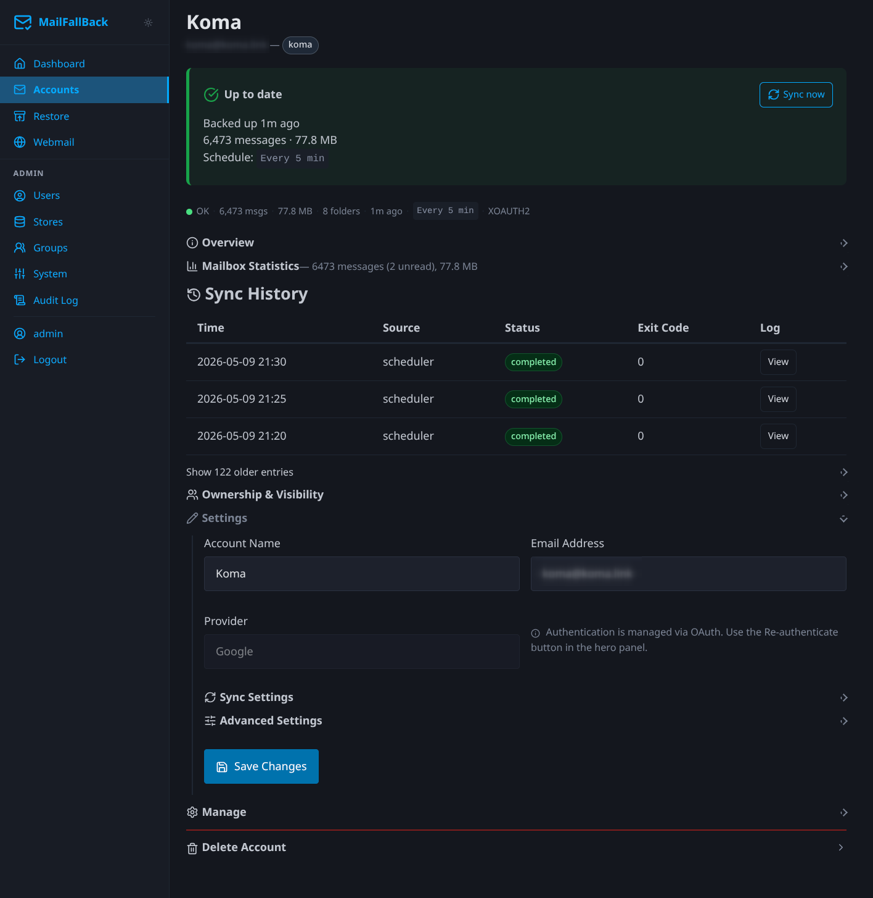

# Accounts

Accounts represent email mailboxes that MFB backs up. Each account connects to an upstream IMAP server and syncs mail to local Maildir storage.

## Accounts List

The accounts page shows all your email accounts in a table.

| Column | Description |
|--------|-------------|
| **Account** | Display name and email address |
| **Owner** | User(s) who own this account |
| **Auth** | Authentication type - app password or OAuth2 |
| **Stats** | Message count and storage size |
| **Status** | Current sync state (idle, syncing, error) |
| **Last Sync** | When the last sync completed |
| **Actions** | Kebab menu with quick actions |

The kebab dropdown on each row provides:

- **Sync Now** - trigger an immediate sync
- **View Details** - open the account detail page
- **Disable/Enable** - toggle the account

## Adding an Account

Click the "Add Account" button to create a new backup account.

### Provider Auto-Discovery

When you enter an email address, MFB attempts to auto-discover the IMAP settings for the provider. It checks:

1. Well-known providers (Gmail, Outlook, Yahoo, iCloud, etc.)
2. DNS MX/SRV records
3. Mozilla ISPDB (autoconfig database)

If discovery succeeds, the IMAP host, port, and TLS settings are filled in automatically.

### Authentication Methods

#### App Password

For providers that support app-specific passwords (most non-Google, non-Microsoft providers):

1. Generate an app password in your email provider's security settings
2. Enter the IMAP username (usually your email address)
3. Enter the app password

!!! tip "Two-factor authentication"
    If your email account uses 2FA, you almost always need an app password rather than your regular password. Check your provider's documentation.

#### Google OAuth2

For Gmail accounts:

1. Select "Google OAuth2" as the auth type
2. Click "Authorize with Google"
3. Sign in to your Google account and grant access
4. MFB stores the refresh token and automatically handles token renewal

Requires the admin to configure Google OAuth2 credentials. See [OAuth Providers](../admin-guide/oauth-providers.md).

#### Microsoft OAuth2

For Outlook.com, Hotmail, and Microsoft 365 accounts:

1. Select "Microsoft OAuth2" as the auth type
2. Click "Authorize with Microsoft"
3. Sign in and grant access
4. MFB stores the refresh token for automatic renewal

Requires the admin to configure Microsoft OAuth2 credentials. See [OAuth Providers](../admin-guide/oauth-providers.md).

### Sync Schedule

Set a cron expression for automatic sync. Common examples:

| Expression | Schedule |
|------------|----------|
| `0 * * * *` | Every hour (default) |
| `*/15 * * * *` | Every 15 minutes |
| `0 */4 * * *` | Every 4 hours |
| `0 2 * * *` | Daily at 2 AM |
| `0 0 * * 0` | Weekly on Sunday |

Leave empty to disable automatic sync (manual sync only).

### Advanced Settings

- **IMAP User** - override the IMAP username if it differs from the email address
- **TLS Type** - `IMAPS` (port 993, implicit TLS) or `STARTTLS` (port 143, upgrade to TLS)
- **Extra Config** - additional mbsync configuration lines appended to the generated config

## Account Detail

Click on an account name or select "View Details" from the kebab menu.

The detail page shows:

### Info Table

Basic account information: email, provider, IMAP server, auth type, sync schedule, and current status.

### Mailbox Stats

Per-folder message counts and sizes, fetched from the Dovecot doveadm API. Shows folders like INBOX, Sent, Drafts, and provider-specific folders (e.g. `[Gmail]/All Mail`).

### Ownership and Visibility

Manage which users own this account and which groups can see it. Multiple users can own the same account. Group visibility provides read-only IMAP access to group members.

### Edit Account

Modify IMAP settings, auth credentials, sync schedule, and display name.

### Migrate Store

Move this account's maildir to a different mail store. The migration copies all files, verifies the copy, and updates the database. Sync jobs and Dovecot login are blocked during migration.

### Sync History

A table of recent sync jobs with status, duration, message counts, and expandable log output.

!!! note "Shared accounts"
    An account can have multiple owners. All owners see the same backed-up mail. Reassigning ownership is a database-only change - no files are moved.

## Triggering a Manual Sync

Click "Sync Now" on any account to start an immediate sync. The sync runs in a background worker using mbsync. You can watch the progress on the account detail page, which updates via HTMX polling.

## Disabling an Account

Disabled accounts are skipped by the scheduler and cannot be synced manually. The backed-up mail remains accessible through Dovecot and webmail. To re-enable, click the enable button from the accounts list or detail page.

## Suspending an Account

Admins can suspend an account, which blocks both sync and IMAP access. This is useful when investigating issues without deleting the account or its data.
