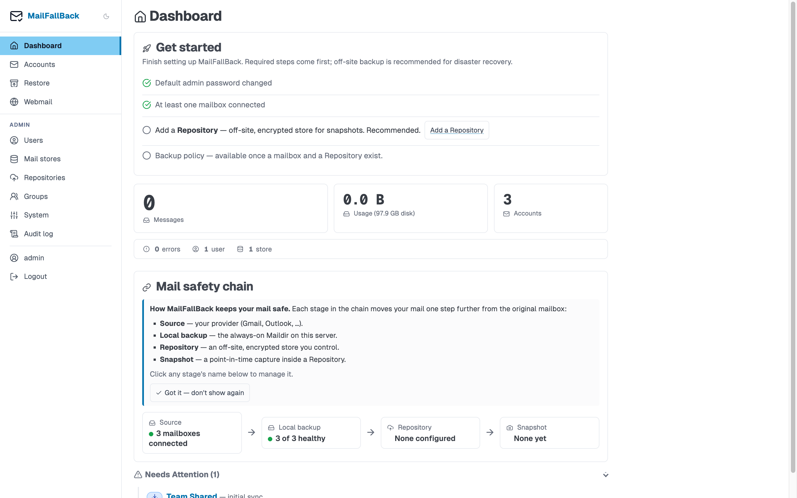

# Dashboard

The dashboard is the landing page after login. It provides an overview of your email backup status at a glance.

## Stat Cards

The top section displays a 3x2 grid of stat cards:

| Card | Description |
|------|-------------|
| **Mailboxes** | Number of mailboxes you can see |
| **Messages** | Total message count across those mailboxes |
| **Usage** | Disk space used by their local backups |
| **Failed** | Mailboxes whose last sync failed |
| **Users** | Total registered users (admin only) |
| **Mail stores** | Number of configured mail stores (admin only) |

Regular users see their own mailboxes. Admins see system-wide totals.

## Needs attention

The "Needs attention" panel lists mailboxes that need someone to act:

- **Sync failed** - the last sync failed. The reason is shown inline (for example "The server rejected the password."); the raw error is on the mailbox page.
- **Sign-in needed** - the Google or Microsoft sign-in expired. Owners and admins get a Reconnect button; group members are told to ask the mailbox owner or an admin.
- **Out of date / Never synced / Initial sync stalled** - nothing has been copied for longer than the mailbox's schedule allows.
- **Snapshot failed** - the last off-site back-up of a mailbox (or, for admins, of the configuration) failed.

Self-recovering states (paused for the daily budget, provider throttling, a restart) and suspended mailboxes are not listed. Each item links to the mailbox page.

## Recent activity

The activity feed shows the most recent sync jobs across all your accounts:

- **Account name** and email address
- **Status** - completed, failed, running, or pending
- **Timestamp** - when the sync finished or started
- **Duration** - how long the sync took
- **Summary** - new messages pulled, channels synced

Click any entry to view the full sync job log.

## System Status Bar

At the bottom of the dashboard, a status bar shows the health of connected services:

- **IMAP access** - whether Dovecot (the read-only IMAP server) and its admin API respond
- **Search index** - whether a full-text search reindex is running or failed
- **Tika** - whether the Tika service is available (if enabled)
- **Scheduler** - whether the sync scheduler is running
- **Modules** - which optional modules are active (webmail, FTS)

!!! tip "Auto-refresh"
    The dashboard refreshes its data periodically via HTMX. You do not need to reload the page to see updated sync status.
