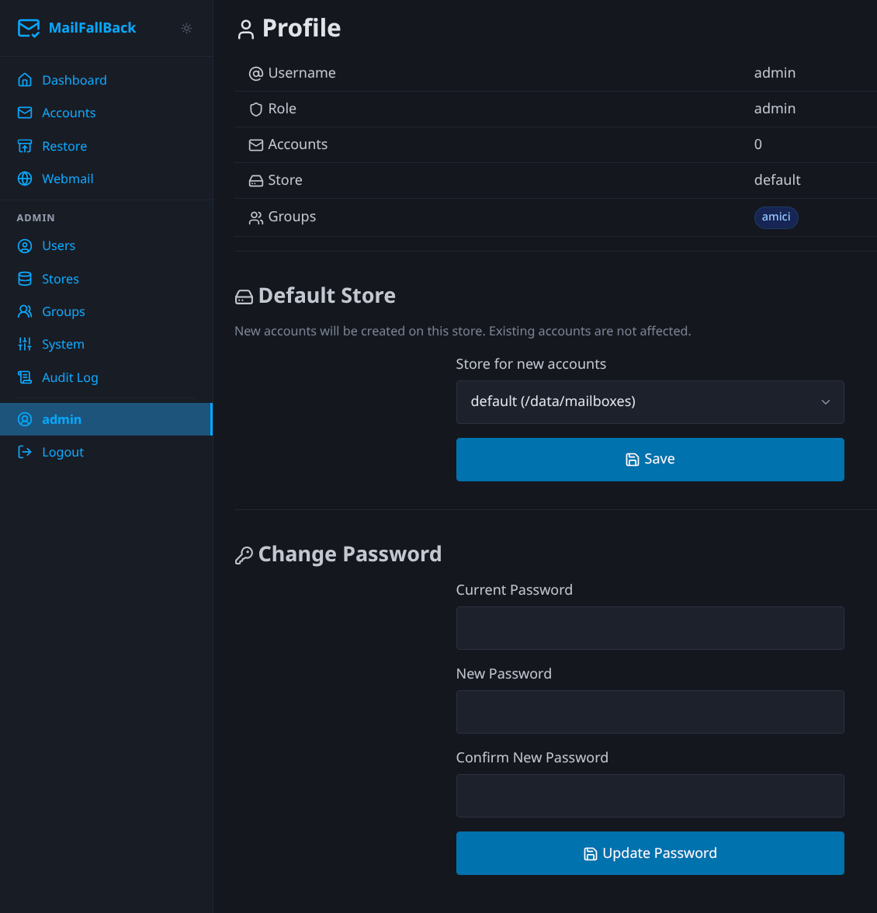

# Profile

The profile page lets you manage your account settings, change your password, and configure preferences.

## Change Password

To change your MFB password:

1. Go to **Profile** in the sidebar
2. Enter your current password
3. Enter and confirm your new password
4. Click **Change Password**

!!! note "SSO users"
    If you log in via OIDC/SSO, your password is managed by the identity provider. The password change section is not available for SSO-only accounts.

## Select mail store

If an admin has granted you access to multiple mail stores, you can select which store new mailboxes are created on:

1. Go to **Profile**
2. Select a store from the "Default Store" dropdown
3. Click **Save**

This affects where new accounts' maildirs are created. Existing accounts remain on their current store.

## Preferences

### Dark Mode

Toggle between light and dark themes. The preference is saved to your user profile and persists across sessions. You can also use the theme toggle in the site header.

## Account Information

The profile page displays:

- **Username** - your login name
- **Role** - admin or user
- **Created** - when your account was created
- **Store** - your currently assigned mail store
- **Account count** - number of email accounts you own
