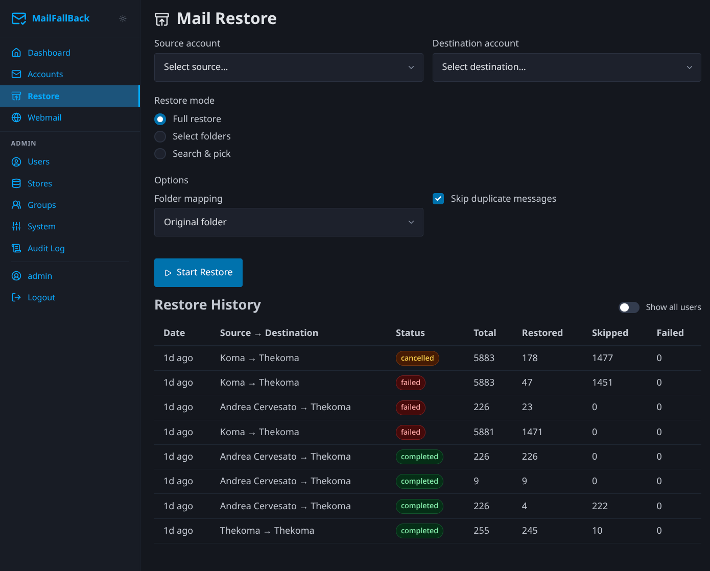

# Restore

The restore feature pushes backed-up messages from a source account back to a live IMAP server through a target account. This is useful when you need to recover mail after an account compromise, provider outage, or data loss.

## How Restore Works

1. MFB creates a temporary IMAP user in Dovecot with read access to the source account's maildir
2. It connects to both the source (Dovecot, local) and target (remote IMAP) accounts
3. Messages are copied from the source folders to the target, folder by folder
4. Progress is tracked in real time with message counts and percentage

The source backup is never modified - restore is a copy operation.

## Creating a Restore Job

1. Go to the **Restore** page from the sidebar
2. Select the **source account** - the backed-up account to restore from
3. Select the **target account** - the live IMAP account to push mail into
4. Choose a **restore mode**:
   - **Full** - restore all messages from all folders
   - **Folder** - select specific folders to restore
   - **Selection** - restore individual messages by UID (advanced)
5. Configure **folder mapping** and options
6. Click **Start Restore**

### Folder Mapping

| Mode | Description |
|------|-------------|
| **Original** | Folders are created on the target with the same names as the source |
| **Flat** | All messages go into a single target folder |
| **Prefix** | Folders are prefixed with a custom string (e.g. `Restored/INBOX`) |

### Options

- **Skip duplicates** (default: enabled) - checks Message-ID headers to avoid restoring messages that already exist on the target

!!! warning "Folder separator differences"
    Different IMAP servers use different folder separators. Gmail uses `/`, Exchange uses `.`, and some servers use `~`. MFB maps separators automatically, but deeply nested folders with unusual characters may need manual attention.

## Monitoring Progress

Once a restore job starts, the page shows:

- **Status** - pending, running, completed, or failed
- **Progress bar** - restored / total messages with percentage
- **Folder breakdown** - per-folder progress
- **Skipped count** - messages skipped due to duplicate detection
- **Error count** - messages that failed to restore

The page updates automatically via HTMX polling.

## Cancelling a Restore

Click "Cancel" on a running restore job. The job stops after the current message completes. Messages already restored remain on the target.

## Restore History

The restore page shows a table of all past restore jobs with:

- Source and target accounts
- Status and progress
- Start and completion times
- Error details (if failed)

Admins can view restore jobs from all users by toggling "Show all users".

## Limitations

- Restore requires the target account to have valid IMAP credentials (app password or OAuth2)
- The target IMAP server must support APPEND operations
- Message flags (read, flagged, etc.) are preserved during restore
- Internal dates (received timestamps) are preserved
- Large restores may take significant time depending on message count and network speed
